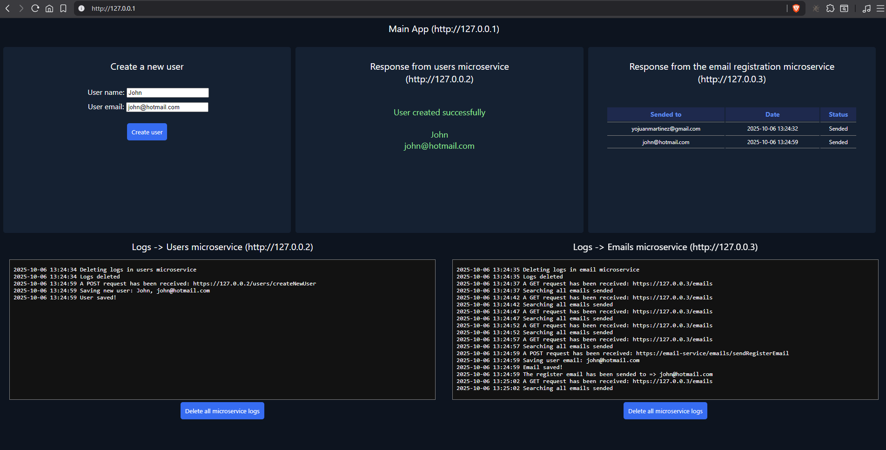
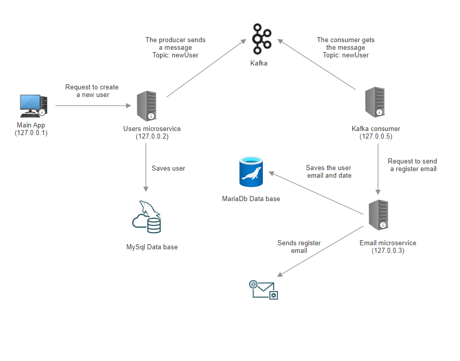

# Microservices in PHP + Kafka + Docker
Example of microservices in PHP + Kafka + Docker

This repository contains a small project to see how the microservices work, and shows how the microservices are connected with kafka to perform differents tasks.

With this application you will can register a new user (name and email) and save them in a data base. Once saved, the system will send a registration email, and store the email and date of dispatch in the database.

You will need to install `Docker` (Docker compose) to launch the diferents services to start and to test it.



## About the script

This script launch eight services. The main application will send a request to a microservice to save the user's data. Once saved, this microservice will send a message to Kafka via the producer. Another service (consumer) will be listening to Kafka so that when it receives a message, it will call the email sending microservice.

## Communication diagram between services



## Services

### Main app
- Apache (lastest)
- HTML, Javascript, CSS

### Users microservice
- Apache (lastest)
- PHP 7.4
- MySQL

### Kafka service
- Zookeeper

### Consumer service
- Apache
- PHP 7.4

### Emails microservice
- Apache (lastest)
- PHP 7.4
- MariaDB

## Quick start

- Install [Docker](https://www.docker.com/products/docker-desktop/) and download all files of this project in a localfolder. 
- In linux or windows open a terminal and go to the project folder.
- Execute this code to create the images and containers in Docker and launch the services:

```Dockerfile

$ docker-compose up -d

```

- Open a browser and open the main app with this url: [http://127.0.0.1/](http://127.0.0.1/)

And that's all!

Developed by Luis L.T.
